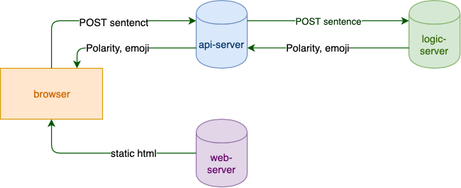

# API server
This is a Flask server that severs the RESTful API.

## Dependence
An important point here. This service depends on the logic-server. As shown
in the python [code](api_server.py), it makes a requests POST to the logic-server.

Now how can we find the logic-server? Most specifically, to make a requests POST, which 
url shall we use for the logic server? We can't hard code an IP address since the logic server
will eventually be a kubernetes service, and it IP is generated when it starts, or even 
after a load-balancer. 

The key point is to control this by an environment variable LOGIC_SERVER. Both docker and
kubernetes can set the environment variable when they start this service, and basically tell 
this service where to find the logic-server. For kubernetes, refer to the discussion of kube-dns
in the appendix of the [README](../README.md) file of the parent folder.

Also note that in general on the IP is dynamically controlled by an env var, the port normally is
hard coded. 

## Run as standalone
python3 api_server.py. _Note_: if LOGIC_SERVER env var is not set, by default, localhost is used. 

### Test
Use this curl command to test

```curl -X -H "Content-Type: application/json" POST http://localhost:7000/sen_emo -d '{"sentence": "Mary has a little lamb"}'``` 

## Docker Container

### Build a docker image

On CentOS use:

```docker build --network=host -t sentiment-api .```
### Run docker container
_NOTE_: Important. You need to run the [LogicServer](../LogicServer/README.md) docker container first before 
you can start this container. Because it depends on the IP of the
logic server container.

After you started the container for the LogicServer, get its IP. Then use it below.

On CentOS us this to bypass the firewall

```docker run -d -p 7000:7000 -e LOGIC_SERVER='http://_logic_server_ip:5000' --net host sentiment-api```

### Verify
Use this curl command to verify.

```curl -X POST -H "Content-Type: application/json" http://localhost:7000/sen_emo -d '{"sentence":"Mary has a little lamb"}'```

### Stop containers
Use

```docker ps | grep sentiment``` 

to find the container ids. Then 

```docker stop _container_id_```

Use 
```docker rm _container_id_```

to remove unused container

Then use

```docker rmi _image_name_```

to remove unused image

## Appendix

We need to handle cross-domain POST request here. As shown in the [README](../README.md) of the parent folder,
the architecture of this POC is like this.


Basically the browser is GETting a html page from the web-server, but then makes a POST request to the api-server.
This is a cross-domain POST request. For security reason, the browser (tested on FireFox and Chrome) will send a _preflight_
OPTIONS request to the api-server. 

In the python [code](api_server.py), it shows how to handle an OPTIONS request, and also an addition header field in
the POST response to make cross-domain POST work.
