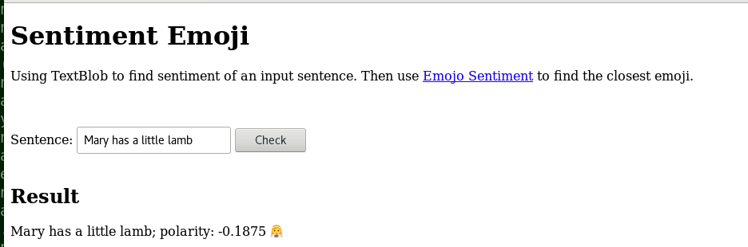
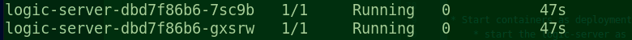
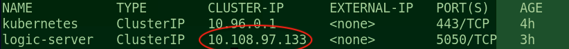
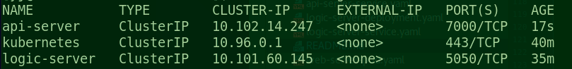

# Microservices

This is a followup project of the [Kubernetes](../Kubernetes) POC. In the Kubernetes POC, Kubernetes (minikube), Docker,
and Flask are used to build a (_single_) web/API service. In some sense, it is a [monolithic](https://articles.microservices.com/monolithic-vs-microservices-architecture-5c4848858f59) 
architecture. 

Microservices architecture on the other hand recommends splitting a monolithic application into a set of
services, following this IBM course: [Getting started with Microservices with Istio and IBM Cloud Kubernetes Servcie](https://courses.cognitiveclass.ai/courses/course-v1:CognitiveClass+CO0301EN+v1/courseware/c6f50877575841a78bb9d60641744f22/55c0eac8ee994eb5888e6c2057ea2f15/).

As a followup of this IBM course, this is a POC built using microservices, following 
this [post](https://www.freecodecamp.org/news/learn-kubernetes-in-under-3-hours-a-detailed-guide-to-orchestrating-containers-114ff420e882/). It
demos how to use Kubernetes to manage/connect microservices. 

_Note_: instead of using node.js as in that post above, we will use python for all microservices in this POC.

## Architecture

This POC contains these three services:

* Presentation: A python flask server (called web-server here) that returns a _static_ HTML file as shown above. 
The [HTML file](WebServer/templates/sentiment.html) contains
javascript code that uses AJAX to communicate with the api-server below. This javascript code is 
activated when the "Check" button is clicked.
* Application integration: A python flask server (called api-server here) that manages the RESTful API. It handles
the POST request from the web-server, process the data and forward it to the logic-server below.
* Business Logic: A python flask server (logic-server) that do the following logics:
    * Given a sentence, use python textbloc to find its polarity (same as the post above)
    * Given a polarity, find the emoji that has the closest polarity (something new/interesting we add)

    
These microservices were designed following the [Twelve-factor methodology](https://www.12factor.net/) as recommended by the IBM course above.

## Prerequites
### Minikube
Minikube is used to create local Kubernetes cluster. This POC runs on Debian 9 VM. Refer to [Minikube](../Kubernetes/README.md) for
instruction on installing minikube on Debian 9 VM. 

Or follow this [link](https://vocon-it.com/2018/11/19/single-node-kubernetes-cluster-1-installing-minikube-on-centos/) to install
minikube on CentOS 8. _Note_: Use minikube v0.30.0. The latest one might not work.

Run this to make sure everything is working first.

* Start minicube

    ```sudo -E minikube start --vm-driver=none```
    
    * use ```sudo minikube delete``` to clean up first if necessary.
* check kube system services

    ```kubectl get services -n kube-systemn```
### kubectl
This is installed together with minikube above. 

### docker

### python
All the source codes are developed using python.

### socat
For CentOS, you might need to install socat first

```sudo yum install -y socat```

## Steps
These are the steps to use. Note here we are going to start the
api server and logic server as deployments and then services.

The web server is started as a pod.

* Start containers as pods:

    ```sudo /usr/local/bin/kubectl create -f web-server-pod.yaml```
    * Use this to check pod
    ```sudo /usr/local/bin/kubectl get pods```
    It shall show web-server STATUS as running. 
    
    * Forward a port to the pod
    
    ```sudo /usr/local/bin/kubectl port-forward web-server 9000:9000```
    
    If everything works fine, you can now use a browser to access
    http://localhost;9000/emo_sen
    * Use this to delete a pod, because we will use services
    
    ```sudo /usr/local/bin/kubectl delete pod _pod_name_```

* Start containers as deployments and services
    * Start the logic-server as a service:
        * Start as a deployment
        
            ```sudo /usr/local/bin/kubectl apply -f logic-server-deployment.yam```
    
        * Use 
    
            ```sudo /usr/local/bin/kubectl get pods```
    
            to check. There shall be two pods
            
    
        * Start up a service
    
            ```sudo kubectl apply -f logic-server-service.yaml```
    
        * check the service, and find the IP to use
    
            ```sudo kubectl get services```
    
            
            Use curl to verify this deployment
    
            ```curl -X POST -H "Content-Type: application/json" http://10.108.97.133:5050/sentiment -d '{"sentence": "Mary has a little lamb"}'```
    
            Again you might need to run this for the IP to work
   
            ```sudo minikube service logic-server --url```
    * Start the api-server as a service
        * Start a deployment
        
            ```sudo kubectl apply -f api-server-deployment.yaml```
        
        * Check pods
        
            ```sudo kubectl get pods```
        
            Now there shall be 3 pods. 
        
        * Start a service    
        
            ```sudo kubectl apply -f api-server-service.yaml```    
    
        * Check services, and find the IP to use
        
            ```sudo kubectl get svc```
            
            
            Our example here shows the IP address is 10.102.14.247:7000
        * Use this curl command to check the whole thing works
        
            ```curl -X POST -H "Content-Type: application/json" http://10.102.14.247:7000/sen_emo -d '{"sentence":"Mary has a litle lamb"}'``` 
        
            _NOTE_ because the api server is a map of the localhost, so this can be
            done as http://localhost:7000 as well.

If everything works, this is what you will see:

            
## Appendix
### Kube-dns/Coredns
Use 

```sudo kubectl get pods --all-namespace```
to check the coredns status. If it is CrashLoopBackoff, follow this
[link](https://github.com/kubernetes/kubeadm/issues/998) to fix it.

